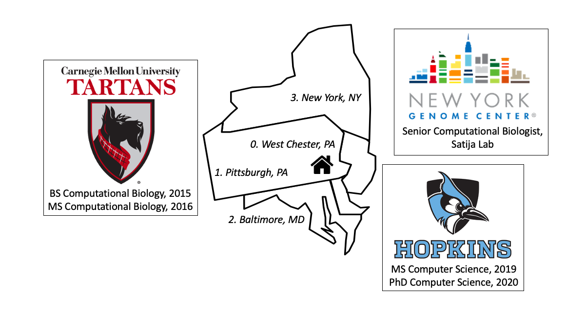

I am an interdisciplinary computer scientist and computational biologist. My research experience spans several areas of computational genomics. I did my PhD studies in the Department of Computer Science at Johns Hopkins University advised by [Mike Schatz](http://schatz-lab.org/) and [Ben Langmead](http://www.langmead-lab.org/). My Masters and Bachelors degrees are from Carnegie Mellon University, where I studied computational biology and did research in phylogenetics with [Dannie Durand](http://www.cs.cmu.edu/~durand/Lab/index.html).

I'm currently a Senior Computational Biologist in the Satija Lab at the New York Genome Center. 

